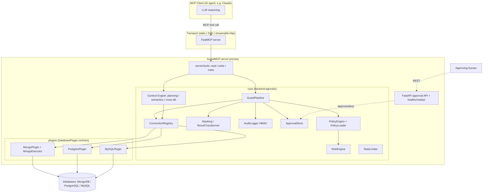
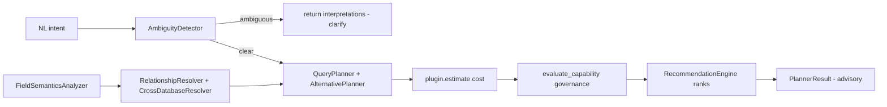
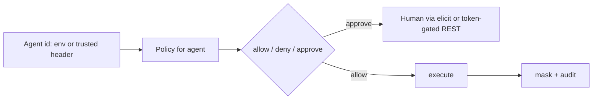

# GuardMCP — Single Source of Truth (SSOT)

> **Status of this document:** Rebuilt from a full rediscovery of the codebase
> (v0.0.1a1). It is a *living* document. Anything not confirmable from the code is
> marked **[Unknown]**, **[Assumption]**, **[Needs Verification]**, **[Not
> Applicable]**, or **[Not Yet Implemented]**. Do not treat unmarked statements as
> infallible — verify against code when in doubt.
>
> **Audience:** project owner, current/future developers, contributors, testers,
> end users (AI agents + operators), and future AI assistants.
>
> **Companion docs (already in repo):** `README.md`, `docs/ARCHITECTURE.md`,
> `docs/PLUGIN_AUTHORS.md`, `INSTALL.md`, `QUICKSTART.md`, `SECURITY.md`,
> `CONTRIBUTING.md`, `CHANGELOG.md`, plus design/plan history under
> `docs/superpowers/`.

---

## 1. Project Overview

**Name:** GuardMCP · **Version:** `0.0.1a1` (alpha) · **Python:** ≥ 3.12
**One-line:** *Policy-enforced, multi-backend MCP server for governed database access — AI proposes, GuardMCP decides.*

### Purpose
GuardMCP sits between an AI agent (an MCP client such as Claude) and a database.
Every operation the AI requests is **evaluated against policy, risk, and masking
rules before execution**, executed only if permitted (or after human approval),
and the result is masked + audited. It also provides **pre-execution database
*intelligence*** (the "Context Engine"): relationship graphs, field semantics,
query planning, and cross-database join-key discovery — advisory information that
helps the AI query correctly without ever bypassing governance.

### Vision
Two pillars: **(1) Governance** — a trustworthy control plane so an AI can touch
production data safely; **(2) Database intelligence** — tell the AI what a
read-only credential cannot (authorized surface, indexes, relationships, field
roles, cost, cross-DB join keys). "Expose *understanding* of the database, not
just the database."

### Problem being solved
A raw database MCP server + a read-only DB user gives an AI unbounded, ungoverned,
unmasked, unaudited access, and no help understanding the schema. GuardMCP adds
policy/masking/audit/approval **and** deterministic (no-LLM) understanding.

### Target users
| User | How they interact |
|---|---|
| **AI agent (MCP client)** | Calls MCP tools (`db_find`, `guardmcp_plan_query`, …) over stdio/HTTP. |
| **Operator / platform owner** | Authors YAML policy, sets env/connection config, runs the server. |
| **Approving human** | Approves/denies HIGH/CRITICAL ops via in-band elicitation or the REST approval API. |
| **Plugin author** | Implements `DatabasePlugin` for a new backend. |

### Scope
In scope: MCP server; policy/risk/approval/masking/audit governance; MongoDB
backend (full); Postgres/MySQL backends (plugin scaffolding); the Context Engine
(planning, relationships, field-semantics, cross-DB); multi-database governance;
stdio + SSE + streamable-HTTP transports; a token-gated REST approval API; an eval
harness.

### Goals
Deterministic governance; data-agnostic intelligence (no hardcoded schema);
backward-compatible, additive evolution; backend-neutral core; strong audit.

### Non-goals
- **No AI/LLM inside GuardMCP** — all reasoning is the client's; GuardMCP is
  deterministic.
- Not a query *optimizer* or execution engine — it governs + advises, the DB executes.
- **No cross-database engine joins** (MongoDB can't) — the AI orchestrates multi-hop
  calls; GuardMCP supplies the join keys.
- Not a web application — **[Not Applicable]** frontend/UI (see §12).

---

## 2. High-Level Architecture

### 2.1 System architecture


### 2.2 Request / governance flow (the heart of the system)
```mermaid
sequenceDiagram
  participant AI as AI client
  participant Tool as MCP tool
  participant P as GuardPipeline
  participant Pol as PolicyEngine
  participant Ex as Executor (plugin)
  participant Aud as AuditLogger
  AI->>Tool: db_find(collection, filter, database?)
  Tool->>P: run(agent, collection, action, params, database)
  P->>P: rate limit check
  P->>Pol: evaluate(policy, risk, database)  %% no execution
  alt DENIED
    P->>Aud: audit(denied); return {status: denied, code}
  else APPROVAL_REQUIRED
    P->>AI: elicit confirmation (in-band) OR create REST approval
    Note over P: TOCTOU re-check on approve
    P->>Ex: execute
  else ALLOWED
    P->>Ex: execute(collection, action, params, database)
  end
  Ex-->>P: raw result
  P->>P: mask fields + field-allow + neutral view
  P->>Aud: audit(success, masked params)
  P-->>Tool: masked result
  Tool-->>AI: envelope {ok/data or error}
```

### 2.3 Context-Engine flow (advisory; never executes)


### 2.4 Cross-cutting flows
- **Authentication flow:** see §11. There is no login/JWT/OAuth. Agent identity is
  **operator-configured** (`GUARDMCP_AGENT`) or a trusted `X-GuardMCP-Agent` header
  behind a gateway; the approval REST API is gated by a shared bearer token.
- **Background jobs:** an in-process asyncio task periodically prunes resolved
  approvals from the in-memory `ApprovalStore` (`__main__._prune_loop`). **[No
  external job queue.]**
- **External services:** the governed databases only. **[No third-party APIs.]**
- **Storage:** policy = YAML files; audit = append-only JSONL file (HMAC-chained);
  approvals = **in-memory** (not durable). See §9.
- **Cache:** in-process schema/type/field-stats cache (`MongoSchemaCache`, TTL/LRU,
  keyed by `(database, collection)`); relationship-graph TTL cache. No external cache.
- **Queues / Event flow:** **[Not Applicable]** — no message queue/event bus.
  Audit records are the only append-only event stream.

---

## 3. Technology Stack

| Layer | Choice | Reason |
|---|---|---|
| **Language** | Python ≥ 3.12 | async, modern typing; MCP SDK is Python. |
| **MCP framework** | `mcp` ≥ 1.27 (FastMCP) | official protocol server + tool registration + transports. |
| **HTTP (approval API + SSE/HTTP transport)** | `fastapi` ≥ 0.116, `uvicorn[standard]` | approval REST API + health probes. |
| **MongoDB driver** | `motor` ≥ 3.7 (async) + `pymongo`/`bson` | primary backend. |
| **Config/validation** | `pydantic` ≥ 2.10, `pydantic-settings` ≥ 2.7 | typed models + env-driven `Settings`. |
| **Postgres backend (optional)** | `asyncpg` ≥ 0.30 | `pip install guardmcp[postgres]`. |
| **MySQL backend (optional)** | `aiomysql` ≥ 0.2 | `pip install guardmcp[mysql]`. |
| **Testing** | `pytest`, `pytest-asyncio`, `mongomock-motor` | unit/integration + in-memory Mongo. |
| **Lint/format** | `ruff` | enforced in CI. |
| **Type-check** | `mypy` **[Needs Verification: enforced in CI?]** | third-party stubs silenced in pyproject. |
| **CI** | GitHub Actions (`.github/workflows/ci.yml`) | **[Needs Verification: exact jobs/matrix]**. |
| **Containerization** | `Dockerfile`, `docker-compose.yml`, `docker/` | see §19. |
| **Logging** | custom structured JSON logger (`core/observability/log.py`) | `GUARDMCP_LOG_LEVEL`/`_FORMAT`; W3C `traceparent` seam. |
| **Monitoring** | `/healthz` `/readyz` (HTTP transports) | **[Assumption: no built-in metrics/Prometheus]** — see §20. |
| **Frontend** | **[Not Applicable]** | GuardMCP is a server; the "UI" is the MCP client. |

CLI entry points: `guardmcp` (`guardmcp.cli:main`) and `guardmcp eval` /
`guardmcp-eval` (`guardmcp.eval.cli:main`). Plugins are discoverable via the
`guardmcp.plugins` entry-point group (mongodb/postgres/mysql).

---

## 4. Folder Structure

```
src/guardmcp/
├── __main__.py            # build(Settings) → wires everything; transport launch (stdio/sse/http)
├── cli.py                 # `guardmcp` CLI entry (subcommands incl. eval)
├── config.py              # Settings (pydantic-settings, GUARDMCP_* env)
├── api/approval.py        # FastAPI approval REST API + health probes
├── core/                  # BACKEND-AGNOSTIC governance + intelligence (no Mongo/SQL here)
│   ├── pipeline.py        # GuardPipeline: evaluate / run / execute / mask / audit / discovery
│   ├── policy/            # models (Policy, per-database scope), engine, loader, explain, trace
│   ├── risk/              # RiskEngine (Action→RiskLevel; cost-escalation, opt-in via Policy.max_cost)
│   ├── masking/           # FieldMasker + ResultTransformer (field-allow + mask, fused)
│   ├── audit/             # AuditLogger (append-only JSONL, HMAC chain), verify
│   ├── approval/          # ApprovalStore (in-memory) + models
│   ├── ratelimit/         # token-bucket limiter
│   ├── registry/          # ConnectionRegistry, CapabilityExecutorAdapter (SQL bridge)
│   ├── interfaces/        # DatabasePlugin, Backend, capability, cost, errors, stores, identity
│   ├── models/domain.py   # Action, RiskLevel, DecisionStatus, Request, Decision
│   ├── context/           # Field-semantics: models + FieldSemanticsAnalyzer
│   ├── planning/          # Context Engine: ambiguity, relationships, planner, alternatives,
│   │                      #   recommend, pipeline, cross_db, cross_db_resolver, models
│   ├── observability/     # structured logging + trace ids
│   ├── neutral.py         # backend-neutral rows/affected/scalar view of results
│   ├── validation.py      # collection_permitted + input param types
│   └── paths.py           # platform state/audit path resolution
├── plugins/
│   ├── mongodb/           # FULL backend: plugin, client, executor, schema_cache, schema,
│   │                      #   marshal, guard, cost, relationships, _serialize
│   ├── postgres/          # PostgresPlugin + SQL translate (via translate_base)
│   ├── mysql/             # MySQLPlugin + SQL translate
│   └── sql/               # shared SQL translation base
├── server/tools/          # MCP tool registration: read.py, write.py, _common.py,
│                          #   _registry.py, meta/{plan,plan_query,relationships,status,
│                          #   capabilities,setup,explain,simulate?}
├── eval/                  # governance eval harness (runner, assertions, reports, cli)
└── conformance/           # plugin conformance checks
policies/                  # example.yaml, test_stdio.yaml
evals/cases/               # YAML eval cases: approval, authorization, databases,
                           #   marshalling, masking, pagination, readonly, security
tests/{unit,integration}/  # ~97 test files
docs/                      # ARCHITECTURE.md, PLUGIN_AUTHORS.md, this SSOT, superpowers/
```
**Ownership:** `core/**` is the governance/intelligence heart — changes here are
security-sensitive. `plugins/**` are backend-specific and must not leak dialect
into `core`. `server/tools/**` is the MCP surface. **Dependency rule:** `core`
never imports a concrete backend; plugins depend on `core.interfaces`.

---

## 5. Modules

| Module | Purpose | Inputs | Outputs | Key deps | Limitations / Future |
|---|---|---|---|---|---|
| `core/pipeline.py` (`GuardPipeline`) | Orchestrates evaluate→approve→execute→mask→audit; discovery (`discover_collections`, `describe_collection`); `evaluate_capability`; connection/database switching; opt-in cost→risk escalation (`_maybe_escalate_for_cost`). | agent, collection, action, params, database | decision + masked result envelope | policy, risk, masking, audit, registry, limiter | `_guard_aggregation` IS per-database (`policy.scope_for(request.database)`) — verified against code + `test_multidb_execution_masking.py`; a prior version of this doc claimed otherwise. |
| `core/policy/` | Per-agent YAML policy: collections allow/deny, actions, mode, mask_fields (flat or dict), fields_allow, approval, connections_allow, temporal window, `extends` inheritance, `api_version`, **per-database** (`databases_allow`, `databases`, `default`). `scope_for(database)`, `mask_fields_for(collection, database)`. | YAML + agent | `Policy`, `Decision` | pydantic | glob deny not supported (exact-match only). |
| `core/risk/engine.py` | Maps `Action`→`RiskLevel`; cost-escalation (`escalate_for_cost`), wired opt-in via `GuardPipeline._maybe_escalate_for_cost`. | action, params, cost | RiskLevel | — | live only for agents with `Policy.max_cost` set; zero I/O otherwise. |
| `core/masking/masker.py` | Recursive key-name masking + field-allow projection, fused single-pass; cached per `(collection, database)`. | raw result, mask set, fields_allow | masked result | — | masking is by key name, **not rename-safe** → aggregation guard compensates. |
| `core/audit/` | Append-only JSONL audit; per-record HMAC chain; `node_id`; fail-closed option; `verify` tool. | events | JSONL file | hmac | HMAC chain is per-process single-writer (multi-replica caveat). |
| `core/registry/` | Named connections; `CapabilityExecutorAdapter` bridges SQL plugins to the internal `Backend`. | Settings | connection entries (client/executor/plugin) | plugins | multi-connection active-db reset semantics; SQL connect is lazy. |
| `core/planning/` (Context Engine) | Ambiguity detection, relationship discovery (within + cross-DB), query planning + alternatives, recommendation, cross-DB identifier alignment, transitive cross-DB path composition. | intent, governed metadata | `PlannerResult`, relationship graphs | policy, plugins | advisory only. |
| `core/context/` | Field-semantics: deterministic per-field role inference. | schema, indexes, edges, sample stats | `SemanticsResult` | — | structural + generic name boosters; no LLM. |
| `plugins/mongodb/` | Full backend: execution, schema/type/field-stats sampling+cache, cost via explain, aggregation guard, relationship inference, distinct-value sampling. | CapabilityRequest / (collection, action, params, database) | results / metadata | motor | streamable-http Motor lifecycle bug **[Needs Verification: fixed?]**. |
| `plugins/postgres`, `plugins/mysql`, `plugins/sql` | SQL backends via `DatabasePlugin` + shared translate base; wired through the adapter; connect lazily. | CapabilityRequest | results | asyncpg / aiomysql | **⚠ Partially Complete / [Needs Verification]** — not exercised against a live SQL DB in this codebase's test suite. |
| `server/tools/` | MCP tool registration (read/write/meta), dual `db_*`/`mongodb_*` aliases, `_run_with_confirm`, `_resolve_database`. | MCP args | envelope strings (`ok`/`err`) | pipeline, context | — |
| `api/approval.py` | FastAPI approval REST API + `/healthz` `/readyz`. | HTTP + `X-Approval-Token` | approval decisions | approval store | token = shared secret; no per-user identity. |
| `eval/` | Governance eval harness: YAML cases → assertions → console/json/junit reports. | `evals/cases/*.yaml` | pass/fail report | pipeline (mock client) | data-level cases run against a mock Mongo. |

---

## 6. Feature Inventory

Status legend: ✅ Completed · 🚧 In Progress · ❌ Not Started · ⚠ Partially Complete · 🧪 Implementation complete, testing incomplete · 🧩 Planned

| Feature | Description | Business purpose | Status | Deps | MCP tools | Governed tables | Perms/config | Known limits |
|---|---|---|---|---|---|---|---|---|
| Policy engine | Per-agent deny-by-default policy | trust boundary | ✅ | — | (all) | policy YAML | `GUARDMCP_POLICY_PATH` | glob deny unsupported |
| Field masking + field-allow | recursive key masking, projection allow-list | data minimization | ✅ | policy | (read/agg) | `mask_fields`, `fields_allow` | policy | key-name based (rename risk → agg guard) |
| Audit log (HMAC) | append-only JSONL, chained | compliance/forensics | ✅ | — | (all) | audit JSONL | `GUARDMCP_AUDIT_*` | single-writer chain |
| Approval workflow | in-band elicit + REST approve | human gate on risky ops | ✅ | approval store, API | (writes) | in-memory | `approval.high/critical`, `X-Approval-Token` | approvals non-durable |
| Risk engine | Action→RiskLevel | drives approval | ✅ | — | (all) | — | — | cost-escalation live, opt-in via `Policy.max_cost` |
| Rate limiting | per-agent token bucket | abuse control | ✅ | — | (all) | — | `GUARDMCP_RATE_LIMIT_*` | in-process |
| MongoDB backend | full CRUD/agg/DDL/introspection | primary data plane | ✅ | motor | live | (governed) | `GUARDMCP_MONGODB_*` | — |
| Postgres/MySQL backends | SQL via adapter + translate | multi-backend | ⚠ / 🧪 | asyncpg/aiomysql | via adapter | (governed) | `GUARDMCP_CONNECTIONS` | **[Needs Verification]** live testing |
| Type marshalling | filter value → BSON type; loud TYPE_MISMATCH | correctness | ✅ | schema cache | (read/agg) | — | — | Mongo-specific |
| Aggregation guard | block cross-collection / masked-field leaks in pipelines | masking integrity | ✅ | policy, executor | aggregate | — | — | Mongo pipeline knowledge |
| Cost estimation | normalized CostEstimate via explain | plan/preview | ✅ | plugin.estimate | `guardmcp_plan`, `guardmcp_plan_query` | — | — | Mongo explain; UNKNOWN default |
| `guardmcp_plan` | concrete-op dry-run (decision/risk/approval/would_affect/cost) | pre-flight preview | ✅ | pipeline | `guardmcp_plan` | — | — | — |
| Query planning (`guardmcp_plan_query`) | NL intent → ambiguity + relationships + ranked plans | AI query intelligence | ✅ | planning | `guardmcp_plan_query` | — | — | advisory only |
| Relationship discovery | within-DB FK/naming/index graph | join awareness | ✅ | plugin.relationships | `guardmcp_relationships` | — | — | heuristic (strip-1-`s`) |
| Field semantics | per-field roles (id/foreign/tenant/timestamp/enum/pii) | schema understanding | ✅ | context | `db_schema` semantics block | — | — | structural + name boosters |
| Data-trust signals v1 | null_ratio/distinct_ratio + freshness (min/max) | data quality awareness | ✅ | context, mongo schema | `FieldSemantics.null_ratio/distinct_ratio/oldest_value/newest_value` | — | — | freshness only for timestamp-role fields; masked fields get none |
| Multi-database governance | per-`database` policy + `database` axis in tools | one URI → many DBs | ✅ | policy, executor, registry | per-call `database`, `db_use_database`, `db_list_databases` | (governed) | `databases_allow`, `databases`, `default` | `_guard_aggregation` IS per-DB (verified) |
| Cross-DB relationships v1 | shared-name + value-overlap join keys | multi-hop workflows | ✅ | planning, sampling | `guardmcp_relationships.cross_db_edges` | — | — | id-shaped names only |
| Cross-DB v2 (signal 3) | identifier-role alignment (foreign→primary across DBs) | stronger join keys | ✅ | field-semantics | `cross_db_edges` kind=identifier_alignment | — | — | pairwise (no transitive path) |
| Connection switching | `switch_connection` between named connections | multi-cluster | ✅ | registry | `db_switch_connection`, `db_list_connections` | — | `connections_allow` | — |
| Capabilities / status / setup | introspection + guided policy scaffold | operability | ✅ | — | `guardmcp_capabilities/status/setup` | — | — | `setup` writes policy |
| Policy explain / simulate | trace a decision / test a hypothetical policy | policy authoring | ✅ | policy trace | `guardmcp_explain_policy`, `guardmcp_simulate_policy` | — | — | — |
| Eval harness | YAML governance cases → report | regression safety | ✅ | pipeline | (CLI) | — | `evals/cases/` | data cases use mock Mongo |
| Transitive cross-DB path | identity→inventory→cost as one path | UX | ✅ | cross-db v2 | `guardmcp_relationships.cross_db_paths`; `compose_transitive_paths()` | — | — | pure post-processing over merged edges, no new sampling; simple-path (no node revisit), weakest-link confidence |
| Compact/verbose response mode | opt-in `verbosity="compact"` strips only the `evidence` reasoning-trace field | token minimization | ✅ | `_strip_evidence()` (server/tools/_common.py) | `guardmcp_relationships`/`plan_query`/`context` | — | — | default `"full"` unchanged; decision fields (kind/confidence/role/etc.) never touched; audit log unaffected |
| Semantics repeat-call stamps | `known_stamps` in → `{unchanged_since}` out for unchanged collections | token minimization | ✅ | `_semantics_stamp()` (pure content hash, no session state) | `guardmcp_context.semantics_stamps`/`known_stamps` | — | — | stale/wrong/absent stamp always falls back to full data; default (no `known_stamps`) unchanged |
| Prompt-injection / exfiltration detection ("AI Safety Layer") | runtime AI security | defense | 🚫 | — | — | — | — | OUT OF SCOPE for this repo — conflicts with the deterministic/no-LLM architecture (hard rule #1); separate product decision |
| Entity-map / business-entity clustering | "what business entities exist" | schema-level grouping | 🧩 | relationship graph | — | — | — | zero existing infra; needs dedicated design pass (algorithm/boundary/confidence all undefined) before any code |

---

## 7. Detailed Feature Documentation (representative deep-dives)

> Full per-feature depth for all features is large; the highest-value/security-critical
> features are detailed here. Others follow the same pattern (see §6 + module docs).

### 7.1 Policy-governed execution (`GuardPipeline`)
- **Overview:** every data op flows `run()` → `evaluate()` (policy+risk, **no
  execution**) → approve if required → execute → mask → audit.
- **User flow (AI):** call a `db_*` tool; receive an `ok`/`err` envelope.
- **Developer flow:** tools call `pipeline.run(agent, collection, action, params, database)`.
- **Sequence:** see §2.2.
- **Data models:** `Request(agent, collection, action, params, database)`,
  `Decision(status, reason, risk, code)`.
- **Validation:** `collection_permitted(name, allow, deny)`; portable filter dialect
  (`$gt/$gte/$lt/$lte/$ne/$in` + bare equality); banned Mongo ops (`$where`,
  `$function`, `$accumulator`, `$out`, `$merge`).
- **Edge cases:** empty allow ⇒ deny-all; DB-level actions skip collection checks;
  temporal window; TOCTOU re-check after approval elicitation.
- **Error handling:** typed `ErrorCode` (see §8); backend errors sanitized per-plugin;
  `TYPE_MISMATCH` surfaced loudly instead of silent empty results.
- **Security:** deny-by-default; masking; audit of every decision incl. denials.
- **Logging/metrics:** structured events (`executor_error`, `type_mismatch`,
  `transient_error_retry`, …) with a per-request trace id.

### 7.2 Masking + field-allow
- Recursive by key name across filter/update/document/pipeline and results; **not
  rename-safe** → `_guard_aggregation` blocks pipelines that reference masked field
  paths or foreign collections. `mask_fields` may be a flat list or
  `{collection→fields}` dict (`"*"` global bucket). `fields_allow` projects results
  to an allow-list (+`_id`), enforced server-side on the *result*.
- **Per-database:** masking resolves via `scope_for(database)` / `mask_fields_for(collection, database)`;
  masker caches keyed `(collection, database)`.

### 7.3 Approval workflow
- HIGH/CRITICAL (per `approval` policy) → `APPROVAL_REQUIRED`. In-band: `ctx.elicit()`
  dialog (client must support elicitation; unsupported ⇒ deny). Out-of-band: REST
  approval API (`GET /approvals`, `GET /approvals/{id}`, `POST /approvals/{id}/decision`)
  gated by `X-Approval-Token`. TOCTOU re-evaluation on approve.
- **[Limitation]** approvals are **in-memory** (lost on restart); pruned periodically.

### 7.4 Context Engine — `guardmcp_plan_query`
- NL intent → `AmbiguityDetector` (schema-driven, no-LLM) → if ambiguous, return
  interpretations + "clarify" (no plan). Else `QueryPlanner` builds a
  `CapabilityRequest`-backed `ExecutionPlan`; `AlternativePlanner` adds an
  aggregation form; each plan gets `plugin.estimate()` cost + `evaluate_capability()`
  governance; `RecommendationEngine` ranks (denied plans surfaced but never
  recommended). Reads metadata only via governed accessors — cannot execute or leak.

### 7.5 Cross-database relationships (v1 + v2)
- v1: id-shaped field names shared across ≥2 databases, confirmed by bounded
  value-overlap sampling. v2 signal 3: `foreign_identifier.references` → another
  DB's `primary_identifier` (even different field names), plus role-boost of v1
  edges. Governed: spans `databases_allow`; masked + `pii`-role fields never
  participate. Output additive in `guardmcp_relationships.cross_db_edges`.

### 7.6 Field semantics (`describe_collection` semantics)
- Deterministic roles: `primary_identifier`, `foreign_identifier`, `tenant_key`,
  `timestamp`, `enum_status`, `pii`, `none`. Structural-first (unique index,
  FK edges, fan-in, BSON type, cardinality); generic English name tokens are
  *confidence boosters only*. Masked fields → `pii` by name; values never sampled.

---

## 8. API Documentation

GuardMCP exposes **two** surfaces: (A) MCP tools (primary), (B) a REST approval API.

### 8.A MCP tools
Tools are registered with dual names: `db_<x>` and a legacy `mongodb_<x>` alias.
Envelope: success `{"ok": true, "data": ..., "error": null, "meta": {}}`; error
`{"ok": false, "error": {"code", "message", "retryable", "suggested_action"}}`.
Authentication: **operator-set agent identity** (not per-call). Common optional
params added by multi-DB: `database: str | None`.

| Tool (db_ / mongodb_) | Purpose | Key params | Notes |
|---|---|---|---|
| `db_find` | query documents | collection, filter, projection, sort, skip, limit, database? | masked + paginated; capped by doc count AND byte budget (`truncated_by_size`) |
| `db_count` | count matches | collection, filter, database? | |
| `db_aggregate` | aggregation pipeline | collection, pipeline_stages, database? | aggregation guard applies; capped by doc count AND byte budget, `_guardmcp_truncated` marker doc appended on either |
| `db_aggregate_db` | DATABASE-level aggregation ($currentOp/$changeStream/$documents/$listLocalSessions/$queryStats — NOT collection data) | pipeline_stages, database? | HIGH risk; $currentOp/$listLocalSessions always route to the `admin` db (real MongoDB requirement — verified live); $currentOp shows all connections' ops; $changeStream bounded to a short best-effort window (no persistent-watch primitive); capped by doc count AND byte budget |
| `db_explain` | plan/explain | collection, filter/pipeline, database? | masked plan |
| `db_export` | write an already-masked find/aggregate result to a local file instead of inline | collection, mode(find/aggregate), filter/pipeline_stages, limit, database? | reuses the exact `pipeline.run()` masking path; returns a manifest (export_id/path/document_count/size_bytes), never the data; files swept past `GUARDMCP_EXPORT_TTL_SECONDS` on the next export call |
| `db_schema` (`mongodb_collection_schema`) | inferred field types **+ `semantics` + `masked_fields`** | collection, sample_size, database? | field-semantics |
| `db_indexes` (`mongodb_collection_indexes`) | list indexes | collection, database? | |
| `db_collection_storage_size` | per-collection storage stats (collStats) | collection, database? | size/storage_size/count/avg_obj_size/total_index_size |
| `db_logs` (`mongodb_logs`) | recent mongod log lines (admin `getLog`) | log_type (global/startupWarnings) | NO_MASK_ACTION — log lines are opaque strings, not documents; capped to `max_limit` lines, then per-line + overall byte budget (`truncated_by_size`) |
| `db_list_collections` | permitted collections | database? | policy-filtered |
| `db_list_databases` | permitted databases | — | filtered to `databases_allow` |
| `db_stats` | db stats | — | **[NV: has `database` param?]** |
| `db_insert_one/many`, `db_update_one/many`, `db_delete_one/many` | writes | collection, document(s)/filter/update, database? | readwrite mode + approval gates |
| `db_create_index`, `db_drop_index` | DDL | collection, keys/index_name, database? | high risk |
| `db_create_collection` | create an empty collection | collection, options?, database? | MEDIUM risk |
| `db_rename_collection` | rename a collection | collection, new_name, database? | HIGH risk |
| `db_drop_collection` | drop a collection + its indexes | collection, database? | CRITICAL risk; `Action.DROP`/executor/risk/capability already existed — only the tool registration was missing |
| `db_switch_connection` | change active connection | connection_name | restores THAT connection's own remembered active database (per-connection, not reset to a shared slot) |
| `db_list_connections` | list connections | — | |
| `db_use_database` | set active database (session) | database | governed + audited; stored per-connection |
| `guardmcp_plan` | concrete-op dry-run | collection, action, filter/update/…​ | decision/risk/approval/would_affect/cost |
| `guardmcp_plan_query` | NL intent → ambiguity/relationships/plans | intent, resource?, verbosity? | advisory |
| `guardmcp_relationships` | relationship graph (+ `cross_db_edges`/`cross_db_paths`) | resource?, verbosity? | advisory |
| `guardmcp_context` | unified pre-flight bundle: plan_query + cross-db + semantics (top-N by centrality) | intent, resource?, verbosity?, known_stamps? | advisory |
| `guardmcp_capabilities` | backend capabilities | — | |
| `guardmcp_status` | connection/policy/active-db/allowed-dbs | — | |
| `guardmcp_setup` | guided policy scaffold | (writes policy.yaml) | side-effect |
| `guardmcp_explain_policy` | trace a decision through rules | request shape | |
| `guardmcp_simulate_policy` | evaluate against a hypothetical policy | policy + request | no side effects |

> **Per-tool request/response/validation/error schemas:** **[Needs Expansion]** — each
> tool's exact JSON schema is defined by its handler signature in
> `server/tools/*.py` (FastMCP derives it). Document per-tool schemas in a follow-up.

### 8.B REST approval API (SSE/streamable-http transports only)
| Method | URL | Auth | Purpose |
|---|---|---|---|
| GET | `/healthz`, `/health` | none | liveness |
| GET | `/readyz`, `/ready` | none | readiness |
| GET | `/approvals` | `X-Approval-Token` | list pending |
| GET | `/approvals/{approval_id}` | token | get one |
| POST | `/approvals/{approval_id}/decision` | token | approve/deny (body: `DecisionPayload`) |

Startup refuses SSE/HTTP without `GUARDMCP_APPROVAL_API_TOKEN` unless
`GUARDMCP_APPROVAL_ALLOW_INSECURE=true`. DNS-rebinding Host-header allow-list via
`GUARDMCP_ALLOWED_HOSTS`. **[Needs Verification: exact request/response bodies.]**

---

## 9. Database Documentation

> **Critical distinction:** GuardMCP does **not own an application schema**. It
> *governs external databases* whose schema belongs to the operator. GuardMCP's own
> persistence is minimal.

### 9.1 GuardMCP's own persistence
| Store | Backing | Durable? | Notes |
|---|---|---|---|
| Policy | YAML file(s) (`GUARDMCP_POLICY_PATH`) | yes (file) | one policy per agent; hot-reloadable **[Needs Verification]**. |
| Audit log | append-only JSONL file | yes (file) | HMAC-chained per record; path via `GUARDMCP_AUDIT_LOG_PATH` / platform state dir. |
| Approvals | in-memory `ApprovalStore` | **no** | lost on restart; TTL-pruned. |
| Schema/type/field-stats cache | in-memory TTL/LRU (`MongoSchemaCache`) | no | keyed `(database, collection)`. |
| Relationship graph cache | in-memory TTL | no | |

### 9.2 Governed databases
- **Tables/collections/relationships/indexes/constraints:** **[Data-agnostic — not
  fixed by GuardMCP.]** Discovered at runtime via `list_collections`,
  `collection_schema`, `collection_indexes`, relationship inference. No hardcoded
  schema anywhere (verified: no product-specific names in `src/`).
- **Migrations:** **[Not Applicable]** — GuardMCP has no ORM/migrations for the
  governed DB; it never alters schema except via explicitly-permitted DDL tools.
- **ER diagram:** **[Not Applicable / runtime]** — produced per-connected-database by
  `guardmcp_relationships`, not statically defined.

### 9.3 Governance enums (GuardMCP's data model)
- `Action` (17): find, aggregate, count, explain, collection_schema,
  collection_indexes, list_databases, db_stats, insert_one/many, update_one/many,
  delete_one/many, drop, create_index, drop_index.
- `RiskLevel`: LOW, MEDIUM, HIGH, CRITICAL. `DecisionStatus`: allowed, denied,
  approval_required.
- `Capability`: read, count, aggregate, write_one/many, delete_one/many, schema,
  indexes, explain, estimate, list_resources, list_databases, stats,
  ddl_create/destroy.

---

## 10. Configuration

All via `GUARDMCP_*` env vars (`config.py::Settings`). Selected (see `config.py` for the full list):

| Var | Default | Purpose |
|---|---|---|
| `GUARDMCP_AGENT` | `default-agent` | operator-set agent identity → selects policy. |
| `GUARDMCP_MONGODB_URI` | `mongodb://localhost:27017` | cluster URI. |
| `GUARDMCP_MONGODB_DATABASE` | `guardmcp` | default (pinned) database. |
| `GUARDMCP_POLICY_PATH` | `policies/policy.yaml` | policy file/dir. |
| `GUARDMCP_AUDIT_LOG_PATH` | platform state dir | audit JSONL path. |
| `GUARDMCP_AUDIT_HMAC_SECRET` | `""` | enables HMAC signing. |
| `GUARDMCP_AUDIT_FAIL_CLOSED` | `false` | abort op if audit write fails. |
| `GUARDMCP_TRANSPORT` | `stdio` | `stdio`\|`sse`\|`streamable-http`. |
| `GUARDMCP_HOST`/`PORT` | `127.0.0.1`/`8000` | HTTP transport bind. |
| `GUARDMCP_APPROVAL_PORT` | `8001` | approval REST API port. |
| `GUARDMCP_APPROVAL_API_TOKEN` | `""` | required for HTTP transports (or…). |
| `GUARDMCP_APPROVAL_ALLOW_INSECURE` | `false` | …explicitly allow no-token. |
| `GUARDMCP_ALLOWED_HOSTS` | `[]` | DNS-rebinding host allow-list. |
| `GUARDMCP_ENFORCE_INDEX_USAGE` | `false` | block unindexed finds. |
| `GUARDMCP_RATE_LIMIT_RPS`/`_BURST` | `0`/`10` | per-agent rate limit (0=off). |
| `GUARDMCP_EXTRA_CONNECTIONS__<name>` | — | extra Mongo connections (share DB name). |
| `GUARDMCP_CONNECTIONS` | `{}` (JSON) | typed connections (SQL wired; **mongodb entries currently skipped** — [Needs Verification vs latest]). |
| `GUARDMCP_LOG_LEVEL`/`_FORMAT` | `info`/`json` | logging. |

**Feature flags:** no dedicated flag system; behavior is env/policy-driven.
**Secrets:** connection strings + `AUDIT_HMAC_SECRET` + `APPROVAL_API_TOKEN` — pass
via env/secret manager, never commit. **Build config:** `pyproject.toml`.

---

## 11. Authentication & Authorization

> There is **no login / session / JWT / OAuth**. **[Not Yet Implemented]** by design.

- **Agent identity** = operator-configured (`GUARDMCP_AGENT`) for stdio; for HTTP,
  a trusted gateway may set `X-GuardMCP-Agent` (trusted only behind an authenticating
  proxy). `GUARDMCP_REQUIRE_AUTHENTICATED_PRINCIPAL` gates unresolved principals.
  Default resolver = `StaticPrincipalResolver` (always the configured agent).
- **Authorization** = the policy engine: per-agent, deny-by-default, per
  (database, collection, action, field), + approval gates + connection allow-list.
- **Approval API auth** = shared bearer token (`X-Approval-Token`), not per-user.
- **Security flow:** identity (config/header) → policy lookup → per-(db,collection,
  action) decision → masking → audit. See §2.2 and `SECURITY.md`.



---

## 12. User Guide

> **[Not Applicable]**: there is **no graphical UI / screens**. "Users" are:

- **AI agent:** register GuardMCP as an MCP server in the client (e.g. Claude
  Code/Desktop `mcpServers`), then call tools. Recommended flow: `guardmcp_status` →
  `db_list_collections` / `db_schema` → `guardmcp_plan_query('…')` → run `db_find` /
  `db_aggregate` (pass `database=` for multi-DB) → for writes, expect an approval
  prompt.
- **Operator:** write a policy YAML (see `policies/example.yaml`), set env, launch.
- **Approving human:** respond to the in-band prompt, or `POST /approvals/{id}/decision`.
- **Common tasks / troubleshooting:** see `QUICKSTART.md`, `INSTALL.md`.
  Common gotcha: "no authorized collections" ⇒ agent's policy `allow` list doesn't
  match the connected database's collections (or wrong `GUARDMCP_MONGODB_DATABASE`).

---

## 13. Developer Guide

- **Setup:** `python -m venv .venv && .venv/bin/pip install -e ".[postgres,mysql]"`
  (this repo uses `.venv/bin/python`; note: `python`/`python3.12` may not be on PATH).
- **Run (stdio):** `GUARDMCP_AGENT=… GUARDMCP_MONGODB_URI=… GUARDMCP_MONGODB_DATABASE=… GUARDMCP_POLICY_PATH=… .venv/bin/python -m guardmcp --transport stdio`.
- **Run (HTTP):** add `GUARDMCP_APPROVAL_ALLOW_INSECURE=true` (dev) `--transport streamable-http`.
  **[Known issue: DB tools may fail under streamable-http with "Cannot use MongoClient
  after close" — Needs Verification whether fixed; use stdio for DB-backed work.]**
- **Test:** `.venv/bin/python -m pytest -q`; eval: `.venv/bin/python -m guardmcp.eval evals/cases/` (42/42).
- **Lint:** `.venv/bin/python -m ruff check src tests`.
- **Build:** standard PEP 517 (`pyproject.toml`). Docker: see §19.
- **Coding standards:** `core` stays backend-agnostic (no Mongo/SQL); all new
  plugin/pipeline params **optional + trailing** for back-compat; deterministic
  (no LLM) in `core`; test fakes must mirror **real** callee signatures (see §21
  Common Mistakes); TDD.
- **Branch strategy:** feature branches (`feat/…`) off the integration branch
  (`Task/v0.0.1_guardmcp-alpha_context_build`), squash-merged. **[Assumption based on
  observed workflow; confirm with maintainer.]**
- **Release process:** **[Needs Verification]** — versioning in `pyproject.toml`
  (`0.0.1a1`); see `CHANGELOG.md`.

---

## 14. Testing Documentation

**Overall:** ~97 pytest files (unit + integration) + 42 YAML eval cases across 8
areas (approval, authorization, databases, marshalling, masking, pagination,
readonly, security). Full suite green (≈816 passed at last review) except one
**known flaky** integration test.

Testing status legend: ✅ Fully Tested · 🧪 Testing pending · ⚠ Partial · ❌ Not tested

| Feature | Unit | Integration | Eval | Status | Gaps / Risk |
|---|---|---|---|---|---|
| Policy engine (+per-DB) | ✅ | ✅ | ✅ (authorization, databases) | ✅ | — |
| Masking / field-allow | ✅ | ✅ | ✅ (masking) | ✅ | per-DB masking at execution covered; audit-side DB threading light ⚠ |
| Audit HMAC | ✅ | partial | — | ⚠ | multi-replica chain untested |
| Approval workflow | ✅ | ✅ | ✅ (approval) | ✅ | REST list/get/decide + token auth covered in `test_approval_api_endpoints.py` |
| Risk engine | ✅ | ✅ | ✅ | ✅ | — |
| Rate limiting | ✅ | ✅ | ✅ | ✅ | `test_rate_limit_integration.py` — real pipeline+limiter, concurrency race, multi-agent isolation, eviction |
| MongoDB backend | ✅ | ✅ | ✅ | ✅ | — |
| Postgres/MySQL | ⚠ | ❌ (no live DB) | ❌ | ⚠ | **not run against real SQL — high risk / Needs Verification** |
| Type marshalling | ✅ | ✅ | ✅ (marshalling) | ✅ | — |
| Aggregation guard | ✅ | ✅ | ✅ (security) | ✅ | per-database (verified) |
| Query planning / plan_query | ✅ | ✅ | — | ✅ | eval-harness coverage 🧪 |
| Relationships v1 | ✅ | ✅ | — | ✅ | — |
| Field semantics | ✅ | ✅ | — | ✅ | — |
| Multi-DB governance | ✅ | ✅ | ✅ (databases) | ✅ | per-DB masking eval deferred |
| Cross-DB v1/v2 | ✅ | ✅ | — | ✅ | — |
| Transports (stdio) | ✅ | ✅ | — | ✅ | — |
| Transports (SSE/HTTP) | ⚠ | ❌ flaky | — | ⚠ | `test_streamable_http_db_tool_survives_session_boundary` **fails (needs live Mongo / Motor-lifecycle bug)** — high risk |
| Approval REST API | ✅ | ✅ | — | ✅ | `test_approval_api_endpoints.py` (list/get/decide + token auth) |
| Performance / load | ✅ | ✅ | — | ✅ | `test_performance.py` (`perf` marker) — throughput bounds + concurrency-correctness (audit chain verifies under concurrent load) |

**Missing / needed:** live SQL backend tests; SSE/HTTP transport hardening;
per-database masking eval cases; explicit security/penetration tests beyond
eval `security` area.

---

## 15. Current Progress Report

| Category | Features | Est. % |
|---|---|---|
| ✅ Completed | Governance core (policy/risk/masking/audit/approval/rate-limit), MongoDB backend, Context Engine (planning, relationships, semantics), multi-DB governance, cross-DB v1+v2, transitive cross-DB path composition, stdio transport | ~85% of stated scope |
| ⚠ Partially complete | Postgres/MySQL backends; SSE/HTTP transport | |
| 🧪 Testing pending / thin | some eval areas for new intelligence features | |
| 🚧 In progress | Phase-2 exec hardening | |
| 🧩 Planned / future | AI-safety layer | |
| ❌ Not started | frontend (N/A), JWT/OAuth (by design N/A), external queue (N/A) | |

> Percentages are **[Assumption]** — no formal tracking system in repo.

---

## 16. Known Issues

- **Bug/[Needs Verification]:** DB tools under **streamable-http** raise "Cannot use
  MongoClient after close" (Motor event-loop/lifecycle). Filed as a follow-up
  (`task_5d2703fd`). Status unknown — verify before shipping HTTP transport.
- **Flaky test:** `test_streamable_http_db_tool_survives_session_boundary` needs a
  live Mongo / the above fix; currently deselected in CI-style runs.
- **Technical debt:** two `indexed_fields` helpers duplicated (planner vs mongo
  plugin); `AlternativePlanner` builds Mongo `$match/$limit` inside otherwise-
  agnostic core; schema cache stores *unmasked* raw_stats (redaction is
  read-time only — safe today, defense-in-depth later).
- **Perf:** basic load/perf sanity suite exists (`test_performance.py`, generous
  bounds not strict SLAs); relationship/value-overlap sampling is bounded but
  unmeasured at scale **[Needs Verification]**.
- **Security risks to track:** approvals non-durable (restart drops pending);
  approval token is a single shared secret; masking is key-name based (mitigated by
  aggregation guard); HMAC chain single-writer.

---

## 17. Roadmap

- **Immediate:** verify/fix the streamable-http Motor lifecycle bug.
- **Short term:** live Postgres/MySQL integration + conformance tests;
  per-database masking eval cases.
- **Medium term:** field-semantics feeding planner ambiguity; deeper performance
  benchmarks (beyond the existing sanity suite) + the eval "wedge" metrics
  (first-query-correctness, denied-call rate, index-backed-plan fraction).
- **Long term:** additional backends (Oracle/SQL Server/SQLite/Snowflake/BigQuery)
  via the plugin contract; distributed audit sink (Redis/Kafka/QLDB) behind the
  existing Protocols.

---

## 18. Backlog

Nice-to-have: mongodb entries in `GUARDMCP_CONNECTIONS`. Ideas/Research/
Experiments: sampling-based relationship confidence; semantic entity clustering
("what business entities exist" — needs a dedicated design pass first: no
existing infra, algorithm/entity-boundary/confidence model all undefined).
**Out of scope for this repo:** AI-safety layer (prompt-injection/exfiltration/
anomaly detection) — conflicts with GuardMCP's deterministic/no-LLM architecture
(hard rule #1); a separate product decision, not a GuardMCP feature.
**[Backlog items are candidates, not commitments.]**

---

## 19. Deployment Guide

- **Local/dev:** `docker-compose.yml` (**[Needs Verification: exact services — app +
  Mongo?]**) or `.venv` + local Mongo. Use stdio for a private single-agent server.
- **Testing:** point `GUARDMCP_MONGODB_DATABASE` at a test DB; run pytest + eval.
- **Production:** container from `Dockerfile`; set `GUARDMCP_TRANSPORT`,
  `GUARDMCP_APPROVAL_API_TOKEN` (mandatory for HTTP), `GUARDMCP_AUDIT_HMAC_SECRET`,
  `GUARDMCP_AUDIT_FAIL_CLOSED=true` (compliance), `GUARDMCP_NODE_ID` per replica,
  `GUARDMCP_ALLOWED_HOSTS` behind a proxy, a **dedicated least-privilege DB user**,
  and a mounted volume for the audit log. **[Production topology/orchestration:
  Needs Verification.]**
- **Rollback:** redeploy previous image/tag; policy + audit are files (back these up).
- **Monitoring:** `/healthz` `/readyz`; scrape structured JSON logs.

---

## 20. Maintenance Guide

- **Logging:** structured JSON (`GUARDMCP_LOG_LEVEL`/`_FORMAT`); each request has a
  trace id; audit is separate from app logs.
- **Alerts/Monitoring:** **[Assumption]** none built-in beyond health probes + logs;
  wire external alerting on audit anomalies / error rates.
- **Backups:** back up policy YAML + audit JSONL. Approvals are ephemeral (nothing to
  back up).
- **DB maintenance:** GuardMCP does not manage the governed DB's lifecycle.
- **Audit integrity:** verify the HMAC chain with `core/audit/verify` (**[Needs
  Verification: exposed as a CLI subcommand?]**).
- **Version upgrades:** pin `mcp`/`motor`/`pydantic`; run the suite + eval before
  promoting. **Disaster recovery:** restore policy + audit files; restart (pending
  approvals are lost by design).

---

## 21. AI Context (read this first, future AI assistants)

- **Project summary:** GuardMCP is a *deterministic* (no-LLM) MCP governance +
  database-intelligence server. The AI **proposes**; GuardMCP **decides, masks,
  audits**, and **advises**. Never add LLM logic to `core`.
- **Architecture:** §2. Golden path: tool → `GuardPipeline.run` → `evaluate`
  (policy+risk, no execution) → approve → execute → mask → audit.
- **Business rules:** deny-by-default; empty `allow` = deny-all; masking is key-name
  based (⇒ aggregation guard); a database not in `databases_allow` ⇒
  `DATABASE_NOT_ALLOWED`; masked fields never sampled/emitted and can't be
  relationship/alignment endpoints; the Context Engine **never executes** and only
  reads **governed** metadata.
- **Naming conventions:** MCP tools dual-named `db_*`/`mongodb_*`; roles are strings
  (`primary_identifier`…); `CapabilityRequest` is the portable IR (do **not** invent a
  new IR); policy field `resource_schema` (not `schema` — shadows pydantic).
- **Important files:** `core/pipeline.py`, `core/policy/{models,engine}.py`,
  `core/interfaces/{plugin,capability,cost,errors}.py`, `plugins/mongodb/{executor,
  schema_cache}.py`, `core/planning/*`, `core/context/semantics.py`,
  `server/tools/_common.py`, `config.py`, `__main__.py`.
- **Critical components:** GuardPipeline, PolicyEngine, AuditLogger (HMAC chain —
  order-sensitive), Masking, ConnectionRegistry, DatabasePlugin contract.
- **Common mistakes (learned the hard way):**
  1. **Test fakes that accept generous `**kwargs` hide real-signature mismatches** —
     two committed-code blockers this project's history came from a tool passing a
     kwarg the real callee didn't accept, green only because fakes were lenient. Use
     real-signature stubs; keep/extend `test_tool_pipeline_contract.py`.
  2. **Green suite can rest on an uncommitted edit** — always `git status` clean +
     run from committed state before trusting results.
  3. New params must be **optional + trailing** (back-compat).
  4. Don't hardcode collection/field/product names (data-agnostic is a hard rule).
  5. Keep dialect (`$match`, SQL) out of `core`; it belongs in plugins.
- **Development principles:** brainstorm→spec→plan→TDD→review→squash-merge; verify
  from a clean tree + full suite + eval each step; mark uncertainty explicitly.
- **Terminology:** *governance* (policy/risk/approval/masking/audit) · *Context
  Engine* (advisory intelligence) · *capability* (backend-neutral op) · *plugin*
  (backend impl) · *tenant/scope key* (the field partitioning multi-tenant data) ·
  *signal 1/2/3* (cross-DB: shared-name / value-overlap / identifier-role alignment).
- **Repo conventions this session used:** `graphify` for codebase orientation
  (may be unavailable in a given shell); `.venv/bin/python` (no `python` on PATH);
  design/plan docs under `docs/superpowers/`.

---

## 22. Future Documentation Checklist

| Item | State |
|---|---|
| Per-MCP-tool exact request/response JSON schemas | **Missing** |
| Approval REST request/response body schemas | **Needs Verification** |
| `GUARDMCP_*` env var **complete** table (this doc is a subset) | **Needs Expansion** |
| CI pipeline (jobs, matrix, gates) | **Needs Verification** |
| `docker-compose.yml` services + production topology | **Needs Verification** |
| Postgres/MySQL backend status + live test evidence | **Needs Verification / Needs Testing** |
| streamable-http Motor lifecycle bug — fixed? | **Needs Verification** |
| Hot-reload of policy behavior | **Needs Verification** |
| `guardmcp_setup` / `explain` / `simulate` exact I/O | **Needs Expansion** |
| Performance/load test plan + results | **Missing / Needs Testing** |
| Audit-chain verification runbook (CLI?) | **Needs Verification** |
| Release/versioning process | **Needs Verification** |
| Multi-replica audit + approval durability design | **Needs Review** |
| Branch/release strategy (confirm with maintainer) | **Needs Verification** |
| Full per-feature §7 deep-dives for every feature in §6 | **Needs Expansion** |

---
*End of SSOT. Keep this file authoritative; update it in the same PR as behavior changes.*
